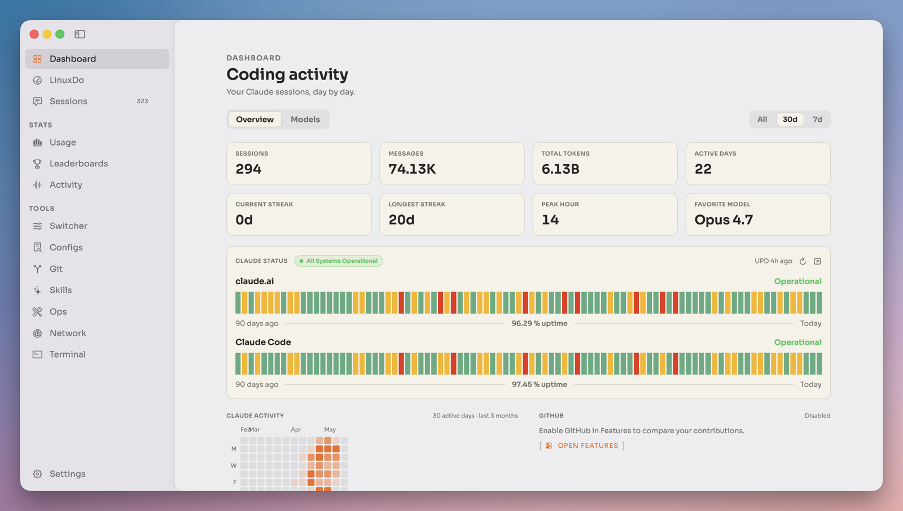
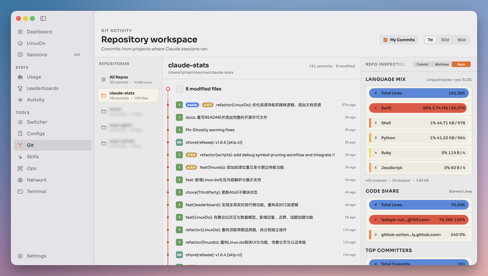
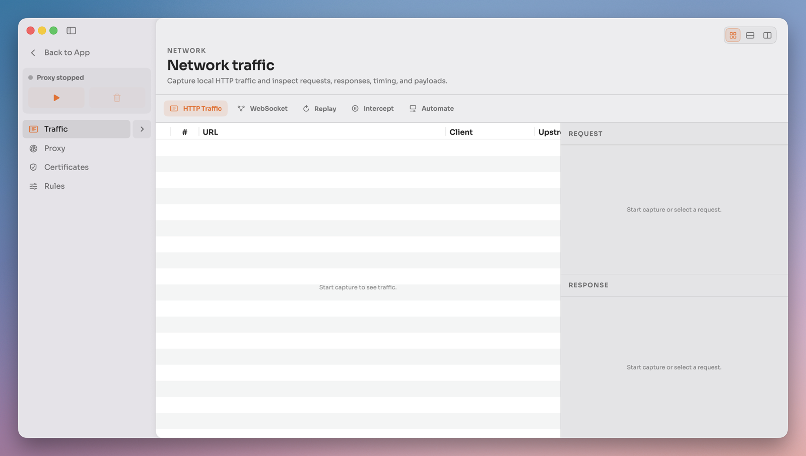

AI 编程工具越用越多之后，一个很现实的问题会慢慢冒出来：我今天到底用了多少 token？哪几个项目消耗最多？缓存命中怎么样？Claude、Codex 的会话和成本能不能放在一个地方看？如果再进一步，能不能把这些数据和 Git 提交、每日工作记录、系统状态放在一起？

[Claude Stats](https://github.com/1pitaph/claude-stats) 做的就是这件事。它是一个开源的原生 macOS 应用，常驻菜单栏，读取本地 AI 编程工具的使用数据，再把会话、token、成本、额度、项目活动、Git 记录和本机状态整理成一个可以随时打开的工作台。

::github{repo="1pitaph/claude-stats"}

截至 2026-06-13，项目最新 release 是 `v1.9.6`。当前打包版本主要面向 Apple Silicon Mac，要求 macOS 15 或更高版本。



## 它解决什么问题

Claude Code、OpenAI Codex 这类工具很适合长时间陪跑开发，但它们的使用痕迹经常散落在不同目录、不同日志和不同状态页里。你能感觉自己今天一直在用 AI，但很难快速回答这些问题：

- 今天一共跑了多少会话、多少 token、多少预估成本？
- 哪些项目最活跃，哪些模型用得最多？
- cache read 和 cache hit rate 表现如何？
- Claude/OpenAI 当前服务状态是否正常？
- AI 活跃时间和 GitHub 提交是否有对应关系？
- 本机开发环境、端口、网络、系统资源是否有异常？

Claude Stats 的核心价值，是把这些分散的信息收束到一个 macOS 原生界面里。它不是另一个聊天窗口，而更像是 AI 编程工作流旁边的“仪表盘”。

## 核心功能

### 1. 菜单栏用量统计

Claude Stats 最基础也最常用的形态，是 macOS 菜单栏应用。打开之后可以快速查看 AI 编程会话、token、预估成本、cache reads、最近活动、provider 切换、刷新、分享导出、更新和设置。


这类信息看似琐碎，但对高频使用 AI 编程的人很有用。尤其是当你同时使用 Claude Code 和 Codex，或者在多个项目之间来回切换时，有一个全局入口会省掉很多翻日志的时间。

### 2. Claude Code 与 OpenAI Codex 日志解析

项目 README 中明确提到，目前支持读取 Claude Code 和 OpenAI Codex 的本地会话日志。Gemini、Kimi、MiniMax 已经在 UI 中识别，但本地会话解析仍属于未来工作。

这点很关键：Claude Stats 已经不是只服务 Claude Code 的单点工具，而是在往多 provider 的 AI 编程统计层发展。

### 3. Dashboard 与 Usage 视图

Dashboard 和 Usage 是更完整的数据视图，包括摘要卡片、模型拆分、token 构成、缓存命中率、成本模式、按日导航、趋势图、Claude/OpenAI 状态卡、GitHub 热力图，以及 AI 活动与 GitHub 活动的重叠分析。


如果你只是偶尔看一眼今天用了多少 token，菜单栏就够了；但如果你想回顾一周的工作节奏，Dashboard 会更合适。

### 4. Daily Report 与 Gantt 工作区

Claude Stats 还提供 Daily Report 和 Gantt 工作区，用来按天汇总 AI 活跃项目，并把工作块、provider、token 强度、专注时间、额度和提交记录可视化。


这个方向很有意思。很多 AI 工具都在强调“生成能力”，但 Claude Stats 更关心使用 AI 之后留下的工作轨迹：你在哪些项目上花了时间，什么时候调用最密集，哪些提交和 AI 会话有关系。

### 5. Git、GitHub 与开发环境视图

项目内置 Git 和 GitHub 活动视图，可以看仓库摘要、diff、图谱/详情视图，并提供 commit message 辅助。完整版本还包含 System Monitor 和 Ops 工作区，可以查看 CPU、内存、磁盘、网络、电源、温度、监听端口、Homebrew 包、Launch Services 和开发环境检查。



这让 Claude Stats 有点像从“用量统计”长成了“AI 开发者控制台”。如果你在 Mac 上做主要开发，它能顺手覆盖不少日常排障信息。



### 6. iOS Companion 与 CloudKit 同步

Claude Stats 包含一个只读 iOS companion，可以在 iPhone 或 iPad 上查看 Mac 端聚合统计。它不是在 iOS 设备上扫描文件，也不会收集手机上的编程活动，而是由 Mac 应用把聚合后的 `StatsSnapshot` 写入用户私有 CloudKit 数据库，再由 iOS app 读取。

iOS 端目前包含 Dashboard、Stats 和 Tool 三个 tab，可以查看同步时间、token、成本、会话、项目、AI time、provider 状态、用量趋势、日报、Gantt 和 Git 活动概览。

需要注意的是，iOS companion 目前不是通过公开 App Store 或 TestFlight 分发，而是从源码里的 `ClaudeStats iOS` Xcode scheme 构建运行。

## 完整版和 Lite 怎么选

Claude Stats 当前提供两个 macOS 版本：完整应用和 Claude Stats Lite。它们使用不同的 bundle identifier 和 Sparkle 更新源，可以并排安装。

| 版本 | 适合谁 | 包含内容 |
| --- | --- | --- |
| Claude Stats | 想要完整工作台、网络调试、终端、Notch Island 和本机 Ops 能力的用户 | 菜单栏统计、Dashboard、Git、日报、Gantt、iCloud 同步、Dictionary、Linux.do、Warp、Config、Ops、Network、Local AI、Memory、Notch Island |
| Claude Stats Lite | 只想看核心用量、项目活动和同步数据的用户 | 菜单栏统计、Git 视图、每日报告、Gantt、排行榜、iCloud snapshot sync |

我的建议很简单：第一次尝试可以先装 Lite。它保留了核心统计体验，也更轻。确认自己确实需要网络调试、内置终端、Notch Island、Ops 或 Local AI 之后，再换完整版本。

## 安装与兼容性

项目的打包版本可以从 GitHub Releases 下载：

- [Latest release](https://github.com/1pitaph/claude-stats/releases/latest)
- [All releases](https://github.com/1pitaph/claude-stats/releases)

当前 release 会同时发布两个 dmg：

```text
ClaudeStats-<version>.dmg
ClaudeStatsLite-<version>.dmg
```

需要注意几个限制：

- 当前打包 macOS release 支持 Apple Silicon Mac 和 macOS 15+
- Intel Mac 不再支持当前 release
- 最后一个同时包含 `x86_64` 和 `arm64` 的公开 universal build 是 `v1.3.9`
- iOS companion 需要 iOS 17+
- 如果下载的是未签名 fallback 构建，macOS Gatekeeper 可能需要右键应用后选择 Open

如果你想从源码构建，需要先拉取 submodules，并安装 XcodeGen：

```bash
git clone --recursive https://github.com/1pitaph/claude-stats.git
cd claude-stats
brew install xcodegen
```

生成 Xcode project：

```bash
bash scripts/generate.sh
open ClaudeStats.xcodeproj
```

日常开发可以使用项目提供的脚本：

```bash
bash scripts/run-debug.sh
bash scripts/run-lite-debug.sh
bash scripts/run-tests.sh
```

## 隐私边界

Claude Stats 最值得单独说的一点，是它的 local-first 设计。核心统计数据读取本地工具目录，例如：

```text
~/.claude/projects/
~/.codex/sessions/
```

面向 iOS companion 的 CloudKit sync 写入用户私有 CloudKit 数据库，上传的是聚合 token、成本、会话数、每日摘要、用量额度快照、活动区间、Dashboard 汇总、状态摘要、Git 摘要行，以及匿名项目标签。

按照项目 README 的说明，它不会上传 prompts、transcript text、filenames、raw project paths 或 full session logs。

排行榜功能是独立且可选的。它发布的是聚合分数和公开 profile 信息，例如昵称、头像和状态文字，不会发布 prompts、transcript、文件名、原始路径、会话标题、模型名或完整日志。

不过，完整版本里的网络调试器能力很强，尤其涉及代理、证书和 HTTPS interception。建议在启用这类功能前认真看一遍项目设置和源码说明，不要把它当成普通统计面板随手全开。

## 适合哪些人

Claude Stats 比较适合这几类用户：

- 高频使用 Claude Code 或 OpenAI Codex 的 macOS 用户
- 想追踪 AI 编程 token、成本、缓存命中率和会话历史的人
- 希望把 AI 活动、Git 提交和项目日报放在一起看的开发者
- 喜欢原生 macOS 菜单栏工具的人
- 需要 iPhone/iPad 只读查看 Mac 端统计的人
- 想要一套 AI 编程工作台，而不是单纯 token 计数器的人

它不太适合这些场景：

- 主要使用 Windows 或 Linux 的用户
- Intel Mac 用户，除非停留在旧 universal build
- 只偶尔用一次 AI 编程、不关心历史统计的人
- 对代理、网络调试、系统权限非常敏感，且不想细看配置的人

## 总结

Claude Stats 的有趣之处，不在于“又做了一个统计面板”，而在于它抓住了 AI 编程工具越来越像日常开发环境一部分的趋势。

当 AI 只是偶尔帮你写一段代码时，用量统计可有可无；但当 Claude Code、Codex 变成每天打开的工作工具，用量、成本、会话、项目、提交、日报和系统状态就会自然变成值得管理的数据。

从这个角度看，Claude Stats 更像是给 AI 编程时代补上的一块基础设施：它把 AI 使用从“感觉今天用了很多”变成“我知道自己在什么时候、哪个项目、用什么 provider 做了什么”。

如果你是 Apple Silicon Mac 用户，并且已经把 Claude Code 或 Codex 放进日常开发流程里，这个项目值得试一下。先从 Lite 开始也可以，轻一点，观察几天自己的 AI 编程节奏，再决定要不要打开完整工作台。
