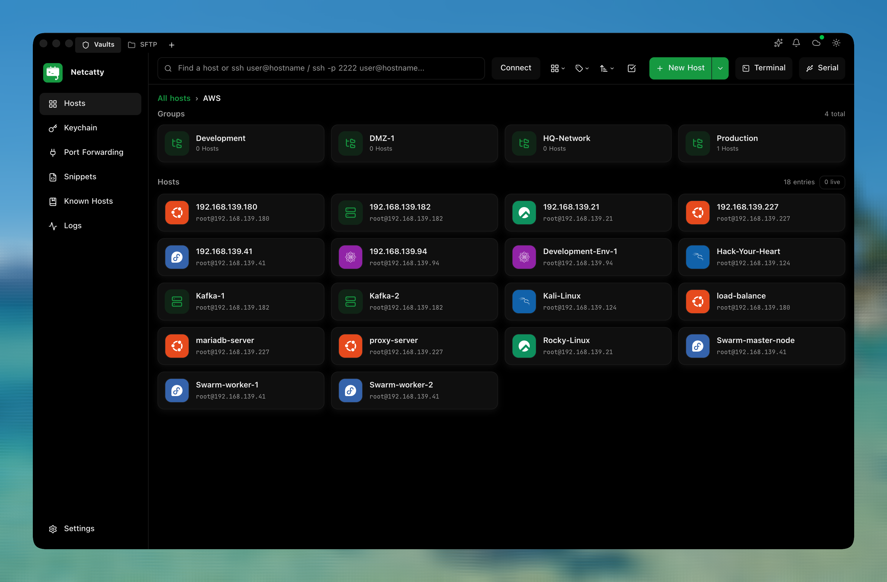
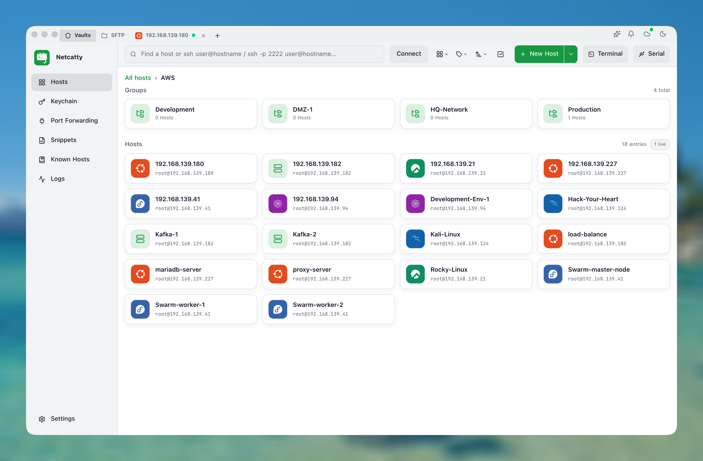
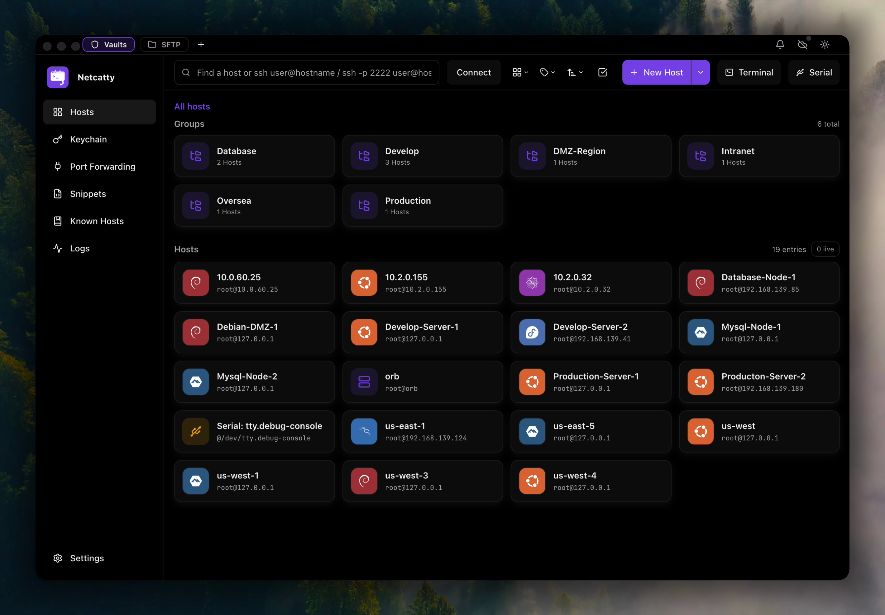
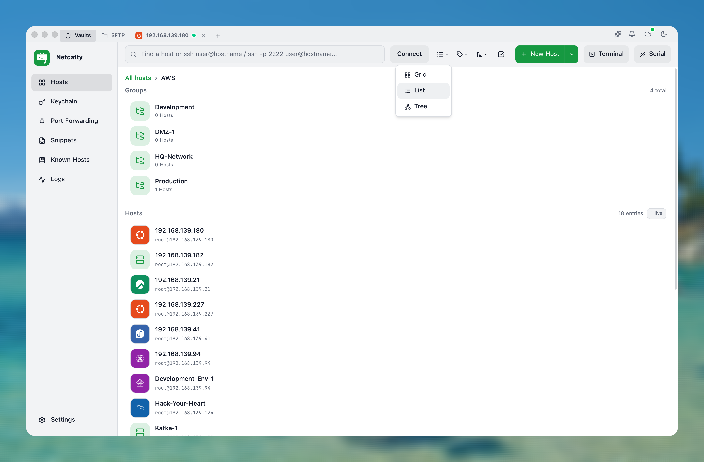
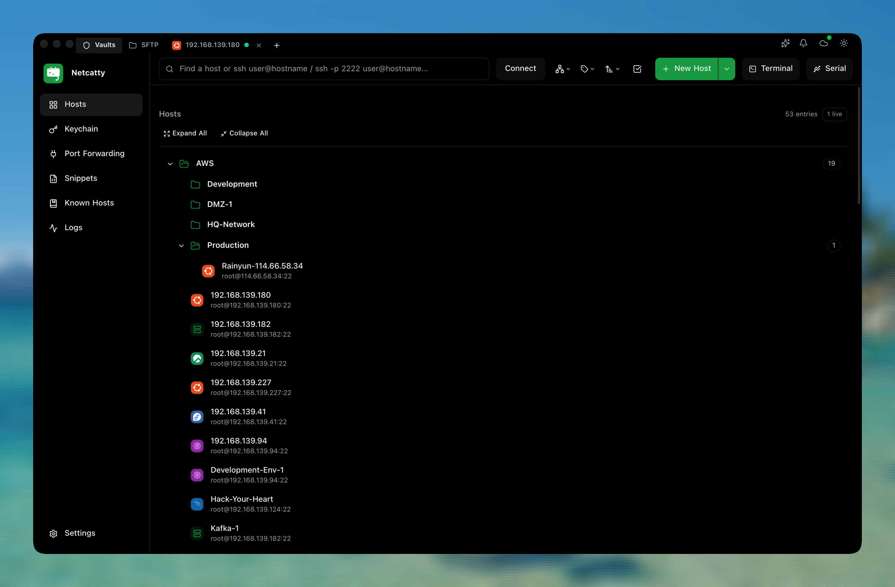
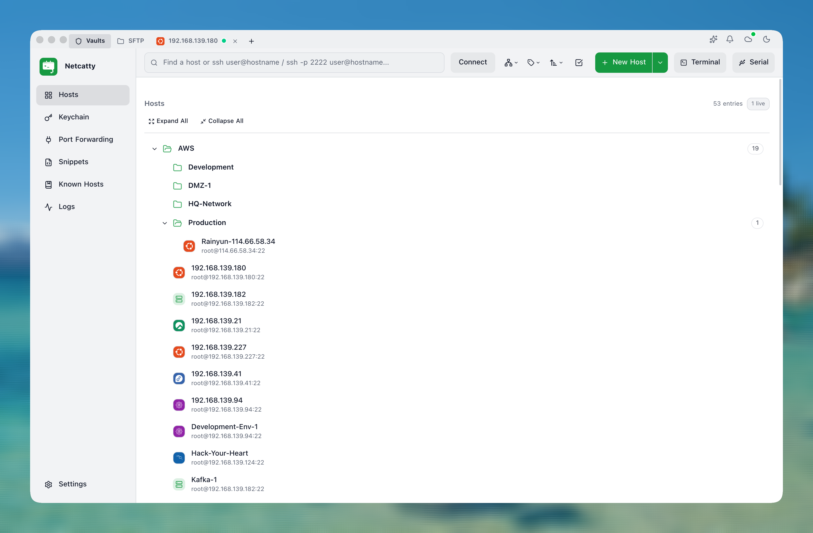
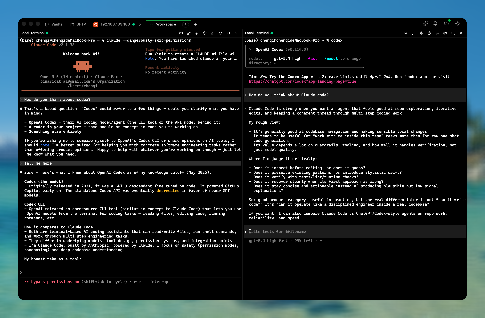
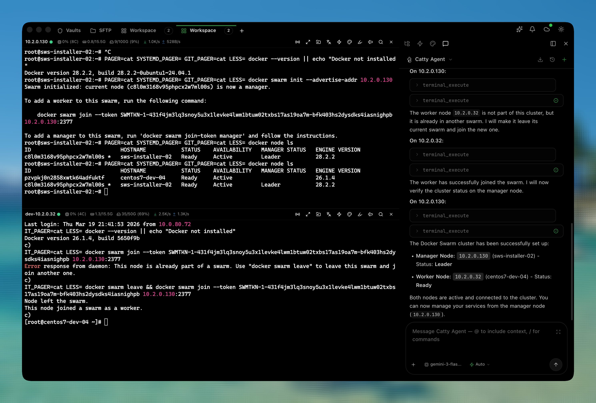

经常连服务器的人，最后都会遇到一个很实际的问题：SSH 客户端、SFTP 工具、终端标签页、主机分组、跳板机配置、临时命令记录，分散在不同工具里还可以忍；一旦服务器数量变多，窗口切来切去就会明显拖慢排障和部署节奏。

[Netcatty](https://github.com/binaricat/Netcatty) 做的是一个更完整的 SSH 工作台：把 SSH 连接、SFTP 文件浏览、分屏终端、主机 Vault、主题、高亮规则和内置 AI Agent 放在一个跨平台桌面应用里。它不是 shell 替代品，而是连接和管理远程 shell 的入口。

::github{repo="binaricat/Netcatty"}

截至 2026-06-14，项目最新 release 是 `v1.1.40`。当前发布包覆盖 macOS、Windows 和 Linux，其中 macOS 提供 Apple Silicon / Intel 构建，Windows 和 Linux 提供 x64 / arm64 相关包。

## 界面截图速览

这些截图来自项目仓库的 `screenshots/` 目录，已经放到本文同目录的 `images/` 下，方便站点构建时走本地资源。

















## 它解决什么问题

如果只是偶尔 SSH 到一台 VPS，系统终端加 `ssh user@host` 就够了。Netcatty 更适合下面这类长期工作流：

- 同时维护多台服务器，需要在不同会话之间快速切换
- 一边看日志、一边执行部署、一边编辑远程配置文件
- 经常上传下载文件，不想在终端、SFTP 客户端和编辑器之间来回跳
- 希望按项目、环境、客户或服务分组管理主机
- 想用自然语言辅助做服务器诊断，但仍然需要明确权限边界

它的定位有点像 PuTTY、Termius、SecureCRT、系统终端和 SFTP 客户端的组合替代品。区别在于它更强调“工作区”：多个连接可以并排存在，主机可以集中管理，文件操作和终端操作放在同一个上下文里。

## 核心功能

### 1. Vault 主机管理

Vault 是 Netcatty 管理连接的入口。它支持网格、列表和树形视图，适合不同规模的主机集合：

| 视图 | 适合场景 |
| --- | --- |
| 网格视图 | 主机数量不多时快速总览 |
| 列表视图 | 需要密集扫描、搜索、按字段判断时 |
| 树形视图 | 按项目、环境、区域或业务线整理服务器时 |

这类设计对运维来说很实用。生产、测试、预发、个人 VPS、客户机器最好不要混在一堆连接里，树形分组和搜索能减少误连、误操作的概率。

### 2. 分屏终端和会话管理

Netcatty 支持水平 / 垂直分屏，适合把相关任务放在一个窗口里处理。例如：

- 左侧部署服务，右侧持续 `tail -f` 日志
- 上方看 `htop` / `docker stats`，下方执行修复命令
- 一边连应用服务器，一边连数据库或反向代理服务器
- 多台机器并排观察同一项配置或服务状态

这比开一堆终端标签页更直观。排障时最怕上下文断掉，分屏能让关键输出一直留在视野里。

### 3. SFTP 文件流和内置编辑器

Netcatty 内置 SFTP 浏览器，支持拖拽上传 / 下载、双窗格文件浏览和就地编辑。这个功能看起来朴素，但对临时改配置、看日志、传证书、上传脚本很省时间。

`v1.1.22` 里还有一个值得注意的更新：SFTP 侧边栏可以复用终端 SSH 连接。实际使用中，这意味着你连上服务器后再打开文件面板，不必把“终端连接”和“SFTP 连接”当成两套完全割裂的流程。

:::tip[使用建议]
临时修改配置文件前，仍然建议先在服务器上备份原文件，例如 `cp nginx.conf nginx.conf.bak.$(date +%F-%H%M)`。图形化编辑很方便，但误保存也会更快发生。
:::

### 4. Catty Agent：内置 AI 运维助手

Netcatty 现在比较吸引人的点，是内置的 Catty Agent。它面向 IT Ops 场景，可以通过自然语言帮你做服务器诊断、查看日志、检查资源状态，并支持多主机编排类任务。

它适合处理这类问题：

- “帮我检查这台机器为什么磁盘快满了”
- “看看 nginx 最近有没有 5xx”
- “检查 Docker 服务和容器状态”
- “对这两台服务器做一次基础健康检查”

不过这里要把边界说清楚：AI Agent 一旦能执行命令，就不再只是聊天助手，而是带有真实操作能力的自动化入口。尤其是多主机场景，错误命令、错误目标、错误权限都会被放大。

:::warning
不要在不了解 Agent 权限模型的情况下，把生产 root 账号直接交给 AI 自动执行。建议先用低权限账号、测试机或只读命令验证，再逐步开放需要的能力。
:::

### 5. 个性化主题和关键词高亮

Netcatty 支持自定义主题，也支持终端输出关键词高亮。关键词高亮对排障很有用，可以把 `error`、`failed`、`timeout`、`denied`、服务名、请求 ID 等内容突出显示。

这不是花哨功能。长日志里找异常时，高亮规则往往能让你早几秒看到关键行，尤其是在实时滚动日志里。

### 6. 连接协议和平台支持

根据项目 README，Netcatty 支持 SSH、本地终端、Telnet、Mosh 和 Serial 等连接方式，具体能力取决于运行环境和可用依赖。常规服务器管理主要还是 SSH + SFTP。

| 平台 | 发布包 |
| --- | --- |
| macOS | Universal，覆盖 Intel / Apple Silicon |
| Windows | x64 / arm64 |
| Linux | x64 / arm64，提供 AppImage、deb、rpm 等包 |

如果你在多平台之间切换，比如日常用 macOS，偶尔在 Windows 或 Linux 桌面上维护服务器，Netcatty 的跨平台体验会比只绑定某个系统终端更顺手。

## 安装方式

最简单的方式是从 GitHub Releases 下载对应平台安装包：

- [Latest release](https://github.com/binaricat/Netcatty/releases/latest)
- [All releases](https://github.com/binaricat/Netcatty/releases)

`v1.1.40` 的 release 页面提供了按系统区分的下载入口：

| 系统 | 常见包类型 |
| --- | --- |
| Windows | 安装版 / 便携版，覆盖 x64 / arm64 |
| macOS | DMG / ZIP，覆盖 Apple Silicon / Intel x64 |
| Linux | AppImage、deb、rpm、pacman，覆盖 x64 / arm64 |

macOS 用户如果遇到 Gatekeeper 提示，优先确认自己下载的是 GitHub Releases 中的最新官方构建。不要从不明网盘或第三方转载链接下载 SSH 客户端，远程连接工具拿到的权限太敏感。

## 从源码运行

如果你想看源码或参与开发，可以按项目 README 的方式运行开发环境：

```bash
git clone https://github.com/binaricat/Netcatty.git
cd Netcatty
npm install
npm run dev
```

项目是 Electron + React + TypeScript 技术栈，终端层使用 xterm.js，SSH/SFTP 相关能力依赖 `ssh2` 和 `ssh2-sftp-client`。

打包命令也比较直接：

```bash
# 生产构建
npm run build

# 为当前平台打包
npm run pack

# 为指定平台打包
npm run pack:mac
npm run pack:win
npm run pack:linux
```

:::tip
普通用户建议直接使用 release 包。从源码跑 Electron 桌面应用需要 Node.js、npm、本机原生依赖和平台打包环境，适合开发者调试，不适合作为日常安装方式。
:::

## 最近版本值得注意的变化

`v1.1.22` 到 `v1.1.40` 这段更新里，值得重点看的不是单纯版本号变化，而是 SSH/SFTP 工作流、桌面体验和 AI 配置都在继续补齐。下面这些来自 `v1.1.22` 的变化，对日常连接体验影响比较直接：

| 变化 | 实际影响 |
| --- | --- |
| SFTP 侧边栏复用终端 SSH 连接 | 终端和文件浏览的割裂感更弱 |
| 支持 `chacha20-poly1305` cipher | 兼容更多 SSH 服务端配置 |
| 支持 ProxyCommand 连接 | 更适合跳板机、代理链、企业内网环境 |
| SSH / Telnet 主协议切换时自动调整默认端口 | 减少手动改端口的小失误 |
| 添加国内 AI provider presets | 配置 AI Agent 时对国内模型服务更友好 |

其中 ProxyCommand 值得单独关注。很多生产环境不会直接暴露 SSH，而是通过堡垒机、跳板机或代理命令进入。如果 Netcatty 能把这类连接方式做进图形化配置里，会比手写一堆 `~/.ssh/config` 对新用户更友好。

## 适合哪些人

Netcatty 比较适合：

- 管理多台 VPS、云服务器或内网主机的开发者
- 经常用 SSH + SFTP 改配置、传文件、看日志的人
- 需要分屏终端处理部署和排障的人
- 想把主机分组、搜索、终端、文件操作放在同一个桌面应用里的人
- 对 AI 运维助手感兴趣，但仍愿意自己审核命令结果的人

它不太适合：

- 只偶尔连一台服务器的轻量用户
- 已经深度依赖 `~/.ssh/config`、tmux、fzf、lazygit 等纯终端工作流的人
- 对 Electron 桌面应用资源占用非常敏感的人
- 不能接受 AI Agent 参与服务器操作链路的生产环境
- 必须使用成熟商业审计、团队权限、集中策略管理的企业场景

## 安全和隐私边界

SSH 客户端不是普通效率工具，它会保存主机地址、用户名、密钥路径，甚至可能接触密码、私钥、端口转发和生产命令。因此使用 Netcatty 时建议注意几件事：

- 优先使用 SSH key，不要长期保存高权限密码
- 为生产服务器准备普通用户，通过 `sudo` 控制提权范围
- 不要把 root 登录作为默认连接方式
- 使用 AI Agent 前，先确认它会读取哪些上下文、调用哪个模型服务、是否会发送命令输出
- 对包含密钥、token、客户数据、数据库连接串的终端输出保持谨慎
- 多主机批量操作前，先在测试环境验证命令
- 从官方 GitHub Releases 下载，避免第三方重打包版本

:::caution
如果服务器日志中包含用户数据、访问 token、数据库 DSN 或内部域名，把这些内容交给云端 AI provider 分析前，需要按自己的合规要求先判断是否允许外传。
:::

## 总结

Netcatty 的价值不在于“又一个 SSH 客户端”，而在于它把远程服务器管理中经常并行发生的几件事放到同一个工作区里：连主机、看日志、传文件、改配置、分屏观察、按组管理，再加上一个可以辅助诊断的 AI Agent。

如果你现在的 SSH 工作流已经被 tmux、ssh config 和命令行工具打磨得很顺，Netcatty 未必会立刻替代它。但如果你经常在多个服务器、多个窗口、多个 SFTP 会话之间切换，又希望有一个更集中的桌面工作台，它就值得试一下。

我的建议是先从普通 SSH + SFTP + 分屏终端开始用，确认 Vault 管理和文件流是否适合自己的日常节奏。至于 Catty Agent，先拿测试机跑只读诊断，再考虑是否引入到更重要的环境里。
