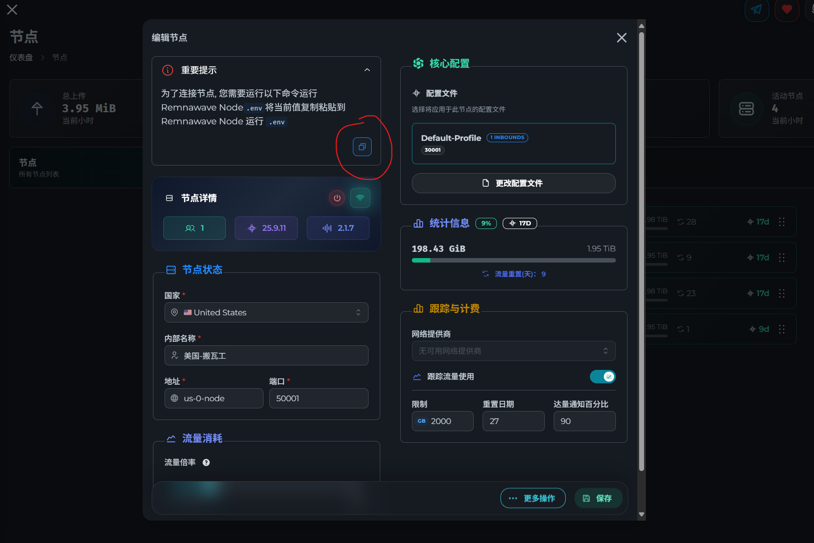
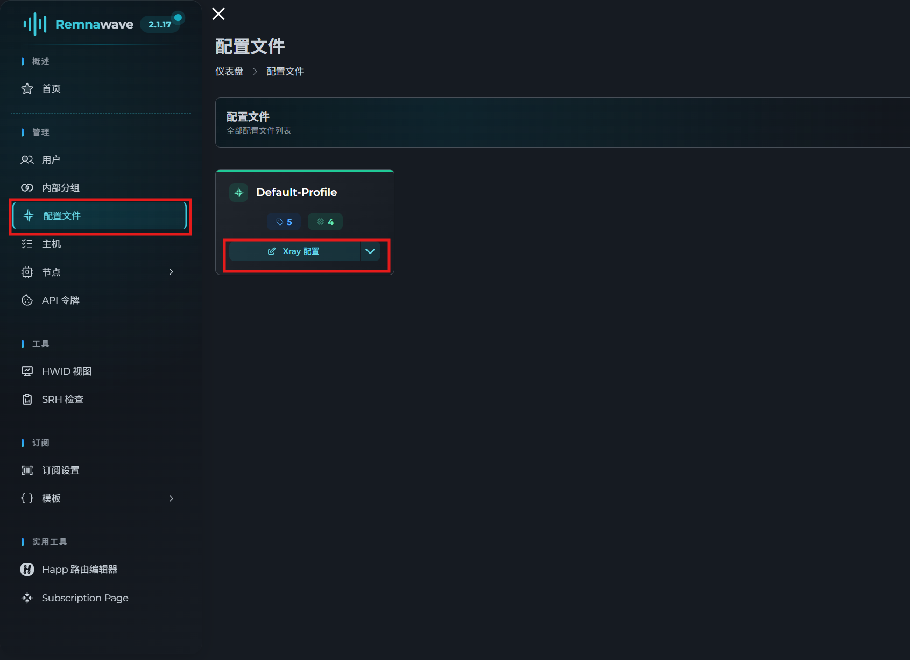
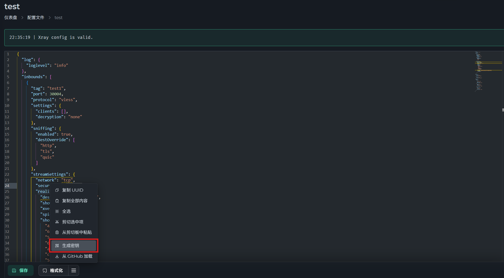
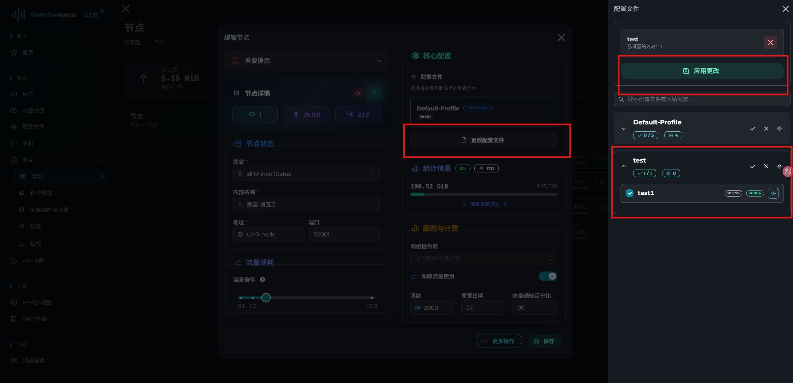
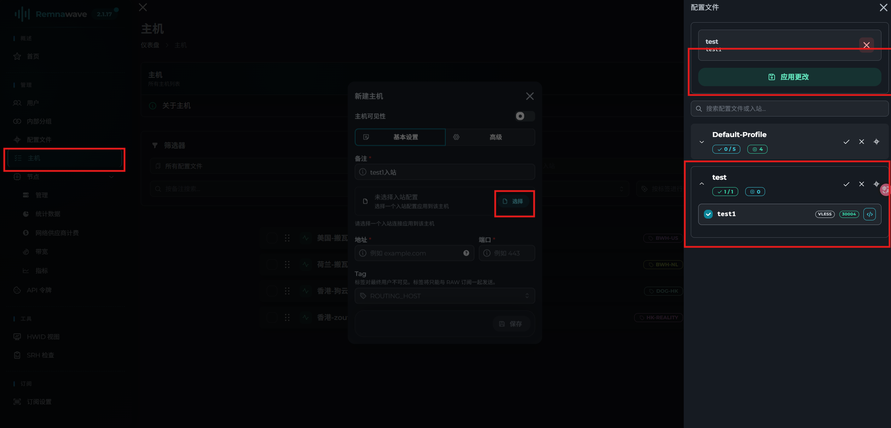
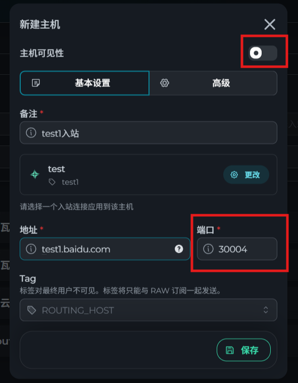
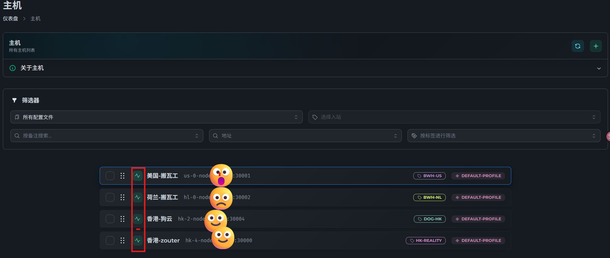
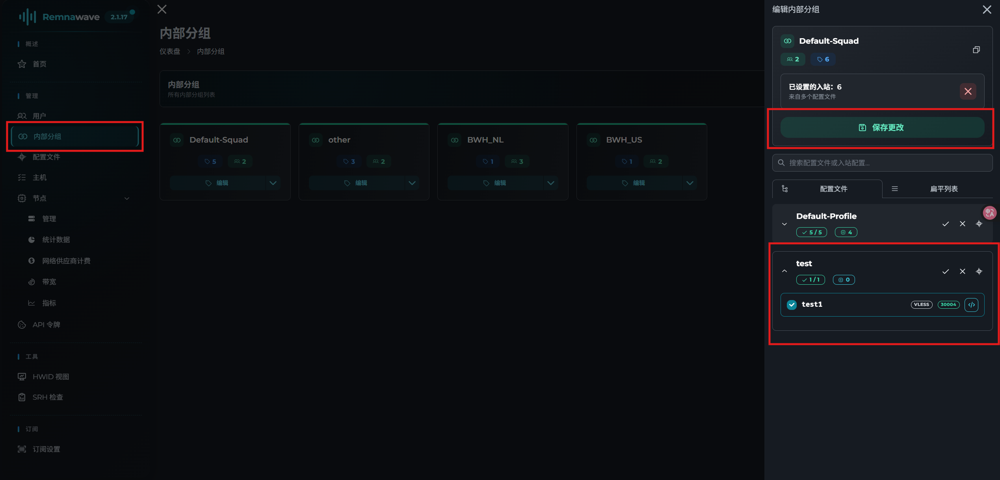
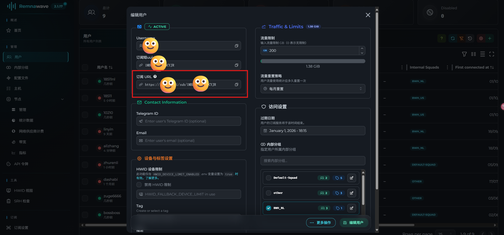

:::note
Remnawave Panel 不包含 Xray-core，因此需要在单独的服务器上安装 Remnawave Node 才能使用完整功能。节点端同样需要先安装 Docker。
:::

## 第一步 - 创建项目目录

```bash
mkdir /opt/remnanode && cd /opt/remnanode
```

## 第二步 - 在面板添加节点

进入面板的 `节点` → `管理`，点击 `+` 按钮添加新节点。

填写表单时注意 **Node Port** 字段，这是节点监听面板内部 API 请求的端口，不用于其他用途。

填好后点击 **`复制 docker-compose.yml`** 按钮，将配置复制到剪贴板。



## 第三步 - 创建 docker-compose.yml 文件

```bash
nano /opt/remnanode/docker-compose.yml
```

将从面板复制的内容粘贴进去，生成的文件格式如下：

```yaml title="docker-compose.yml"
services:
    remnanode:
        container_name: remnanode
        hostname: remnanode
        image: remnawave/node:latest
        restart: always
        network_mode: host
        environment:
          - NODE_PORT=2222
          - SECRET_KEY="supersecretkey"
```

保存文件后启动容器：

## 第四步 - 启动节点容器

```bash
docker compose up -d && docker compose logs -f -t
```

## 第五步 - 完成节点关联

回到面板的节点创建卡片，点击 **`下一步`**，选择所需的**配置文件（Config Profile）**，然后点击 **`创建`** 按钮完成关联。

:::danger 防火墙安全提示
**请务必在节点防火墙中将 `NODE_PORT` 仅对面板服务器的 IP 开放**，不要对公网开放此端口。
:::

## 编辑 Xray 配置文件



### vless+tcp+reality配置

想图方便可以直接复制粘贴进配置文件，入站标签是唯一的可以自定义

```json
{
  "log": {
    "loglevel": "info"
  },
  "inbounds": [
    {
      "tag": "test1",
      "port": 30004,
      "protocol": "vless",
      "settings": {
        "clients": [],
        "decryption": "none"
      },
      "sniffing": {
        "enabled": true,
        "destOverride": [
          "http",
          "tls",
          "quic"
        ]
      },
      "streamSettings": {
        "network": "tcp",
        "security": "reality",
        "realitySettings": {
          "dest": "www.amd.com:443",
          "show": false,
          "xver": 0,
          "spiderX": "",
          "shortIds": [
            "42aeec",
            "66c8bd6b1002427d",
            "5a1f",
            "6c",
            "adfb6126",
            "ce557a621e",
            "5fc062b8b4c2b9",
            "e4cfaf01e274"
          ],
          "publicKey": "3FB5YuwJgxCbQurerSwjhXDIHAB_SRdyecd5XLhtwE0",
          "privateKey": "m5mIb4EXjqkcfDDHRW_pU7Vz-hehwNgR5Hi2HFCO4S0",
          "serverNames": [
            "www.amd.com"
          ]
        }
      }
    }
  ],
  "outbounds": [
    {
      "tag": "DIRECT",
      "protocol": "freedom"
    },
    {
      "tag": "BLOCK",
      "protocol": "blackhole"
    }
  ],
  "routing": {
    "rules": [
      {
        "ip": [
          "geoip:private"
        ],
        "type": "field",
        "outboundTag": "BLOCK"
      },
      {
        "type": "field",
        "domain": [
          "geosite:private"
        ],
        "outboundTag": "BLOCK"
      },
      {
        "type": "field",
        "protocol": [
          "bittorrent"
        ],
        "outboundTag": "BLOCK"
      }
    ]
  }
}
```

`publicKey`和`privateKey`,可以在下方工具栏生成



## 将配置文件与节点关联

如果需要更换已关联的配置文件，可在 `节点` → `管理` 中选中对应节点，点击`更改配置文件`，重新选择 Xray 配置文件和入站标签，点击应用更改后保存。

完成配置文件关联后，节点仍无法直接使用，还需要继续创建主机。



## 创建主机
在这就是将入站真正的开启并监听端口
选择主机 → 创建主机
备注自定义，选择入站配置文件为刚刚创建的`test1`，点击应用更改

可以看到端口自动填入了`30004`，地址要填绑定了节点的IP的域名，将右上角按钮到开启状态，

至此可以看到入站为如下状态


## 最后一步
完成以上的步骤是99%，剩下1%是将配置文件赋予给用户。
进入内部分组，编辑默认分组文件，将配置文件赋予给分组，点击应用更改，再点击保存。


现在可以再用户列表选中用户，看到订阅链接。


此面板玩法极其丰富，适合几个人合租使用。
